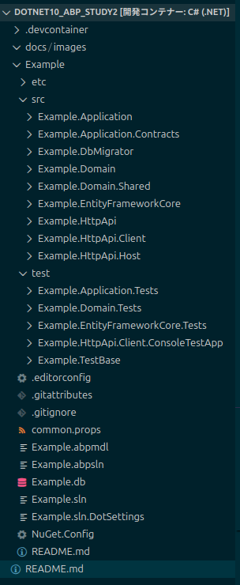
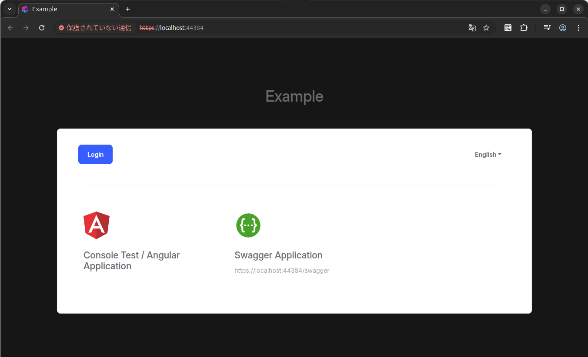
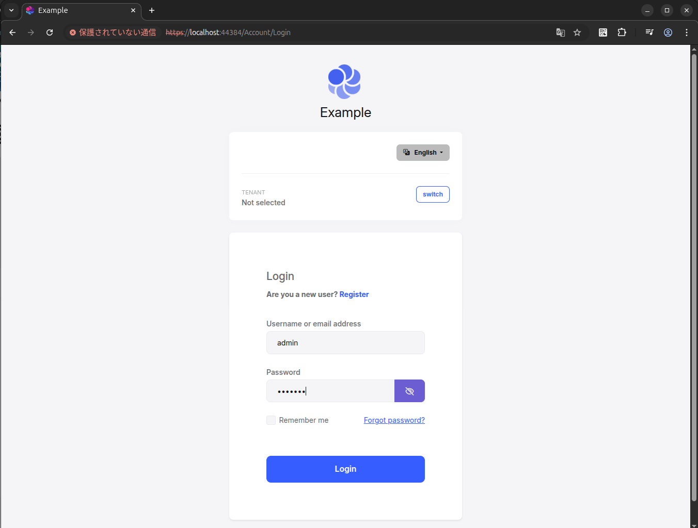
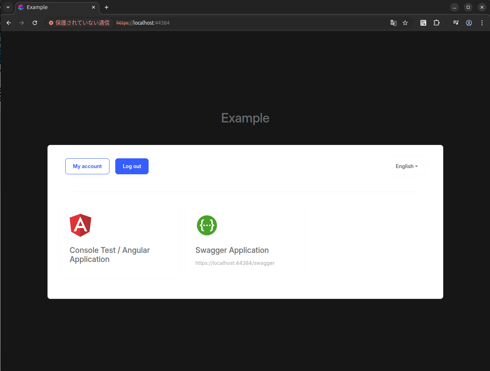
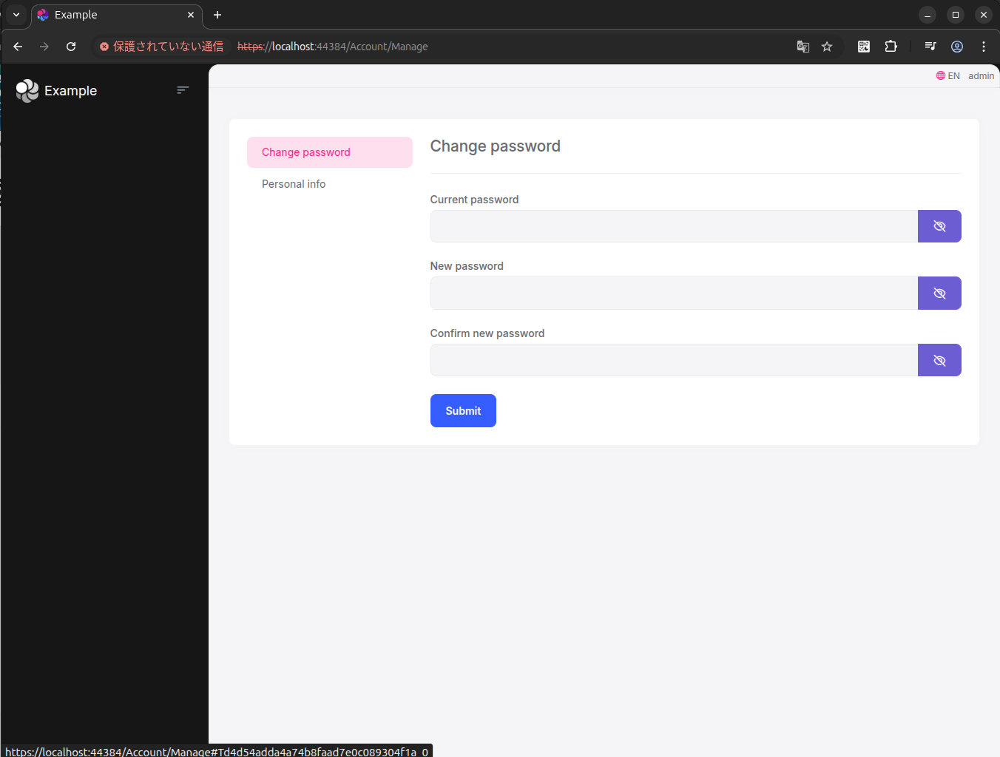
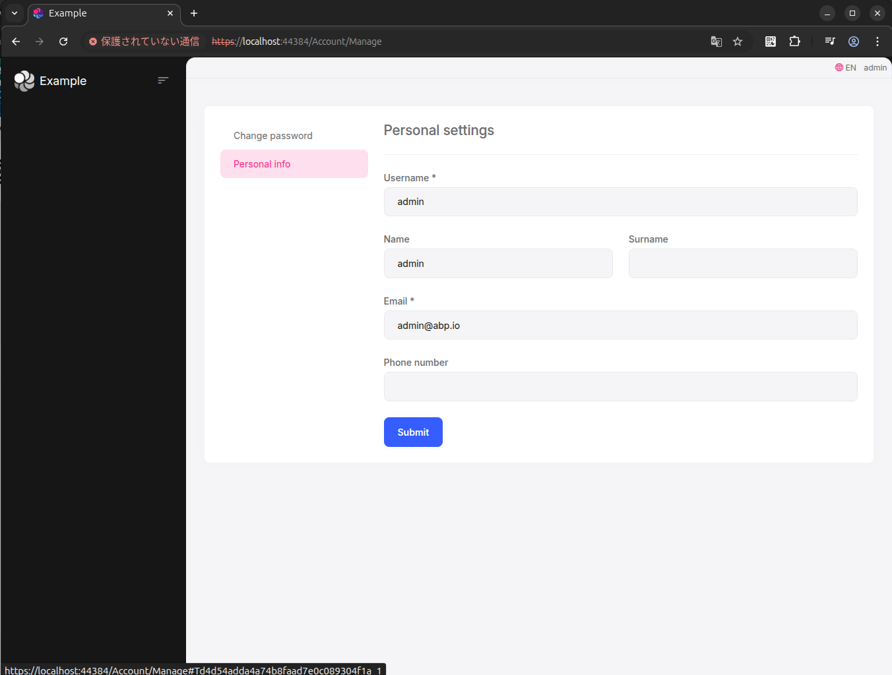
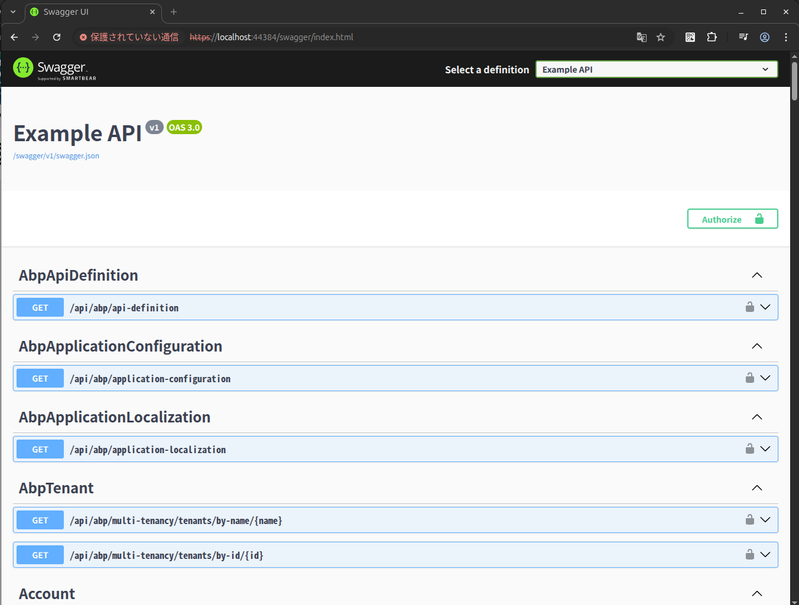
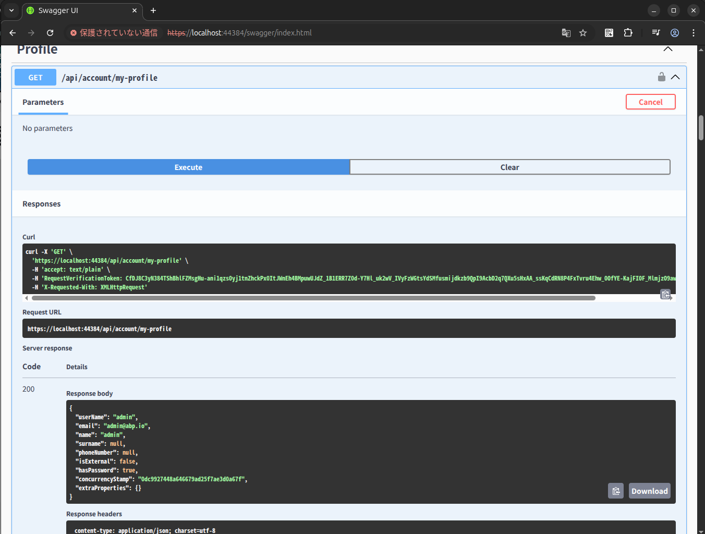

# dotnet10_abp_study2


## 概要
* (前回) [dotnet10_abp_study1](https://github.com/Tobotobo/dotnet10_abp_study1)
* 前回は開発コンテナーが適当だったのでちゃんと構築
* まずは [ABP](https://github.com/abpframework/abp) をシンプルに試す

## 詳細

### 環境

```sh
$ grep VERSION= /etc/os-release 
VERSION="24.04.3 LTS (Noble Numbat)"
```

```sh
$ dotnet --version
10.0.100
```

```sh
$ node --version
v24.11.1
```
TODO: README.md に v18 or 20 って書かれてた 

```sh
$ pwsh --version
PowerShell 7.5.4
```

```sh
$ dotnet ef --version
Entity Framework Core .NET Command-line Tools
10.0.0
```

```sh
$ abp cli version
2.0.1
```

TODO: sqlite3 コマンドのインストール `sudo apt-get update && sudo apt-get install -y sqlite3`

### ソリューション作成

ABP CLI  
https://abp.io/docs/latest/cli  

最新
```sh
abp new Example \
    --template app \
    --ui-framework no-ui \
    --database-provider ef \
    --dbms SQLite \
    --output-folder "./Example"
```

特定のバージョン
```sh
abp new Example \
    --version 9.3.6 --old \
    --template app \
    --ui-framework no-ui \
    --database-provider ef \
    --dbms SQLite \
    --output-folder "./Example"
```
※ソースを表示した時にエラーになる場合は VSCode のウィンドウを再読込みするとだいたい直る

### ソリューションの初期化

```sh
(cd ./Example && pwsh ./etc/scripts/initialize-solution.ps1)
```

### フォルダ構成



### 実行

```sh
dotnet run --project ./Example/src/Example.HttpApi.Host
```

https://localhost:5443  

※ポート番号は `Example/src/Example.HttpApi.Host/Properties/launchSettings.json` を確認
※自動で VSCode のポートフォワーディングに追加されない場合は手動で追加

ID: `admin`  
PW: `1q2w3E*`  











### Swagger

https://localhost:44384/swagger/index.html





### 日本語化
※なんか翻訳指定できる範囲が足りてないような？
　→　abp のソースからかき集めないとダメっぽい？

[abp - Localization](https://abp.io/docs/latest/framework/fundamentals/localization?_redirected=B8ABF606AA1BDF5C629883DF1061649A)

Example/src/Example.Domain.Shared/Localization/Example
```json
{
  "culture": "ja",
  "texts": {
    "AppName": "Example",
    "Menu:Home": "ホーム",
    "Menu:ContactUs": "お問い合わせ",
    "Menu:ArticleSample": "記事サンプル",
    "Home": "ホーム",
    "Welcome": "ようこそ",
    "LongWelcomeMessage": "本アプリケーションをご利用いただきありがとうございます。これは ABP フレームワークを基盤としたスタータープロジェクトです。詳しくは次をご覧ください。",
    "Date": "日付",
    "Permission:Dashboard": "ダッシュボード",
    "Menu:Dashboard": "ダッシュボード",
    "Menu:HomePage": "ホームページ",
    "Dashboard": "ダッシュボード",
    "ExternalProvider:Google": "Google",
    "ExternalProvider:Google:ClientId": "クライアント ID",
    "ExternalProvider:Google:ClientSecret": "クライアント シークレット",
    "ExternalProvider:Microsoft": "Microsoft",
    "ExternalProvider:Microsoft:ClientId": "クライアント ID",
    "ExternalProvider:Microsoft:ClientSecret": "クライアント シークレット",
    "ExternalProvider:Twitter": "Twitter",
    "ExternalProvider:Twitter:ConsumerKey": "コンシューマーキー",
    "ExternalProvider:Twitter:ConsumerSecret": "コンシューマーシークレット",
    "NewsletterHeader": "ニュースレターを購読",
    "NewsletterInfo": "最新情報をお届けします。",
    "NewsletterPreference_Default": "標準ニュースレター",
    "NewsletterPrivacyAcceptMessage": "私は<a href='/privacy-policy'>プライバシーポリシー</a>に同意します。",
    "Language": "言語",
    "Search": "検索",
    "LoadMore": "さらに読み込む",
    "Settings": "設定",
    "Theme": "テーマ",
    "DeviceTheme": "デバイス設定に合わせる",
    "Dark": "ダーク",
    "Light": "ライト",
    "Unspecified": "システム",
    "SeeAllUsers": "すべてのユーザーを見る",
    "TakePhoto": "写真を撮る",
    "ChoosePhoto": "写真を選択"
  }
}
```

Example/src/Example.Domain.Shared/ExampleDomainSharedModule.cs
```cs
    public override void ConfigureServices(ServiceConfigurationContext context)
    {
        Configure<AbpVirtualFileSystemOptions>(options =>
        {
            options.FileSets.AddEmbedded<ExampleDomainSharedModule>();
        });

        Configure<AbpLocalizationOptions>(options =>
        {
            options.Resources
                .Add<ExampleResource>("en")
                .AddBaseTypes(typeof(AbpValidationResource))
                .AddVirtualJson("/Localization/Example");

            options.DefaultResourceType = typeof(ExampleResource);
            
            options.Languages.Add(new LanguageInfo("en", "en", "English")); 
〜〜〜〜〜〜〜〜〜〜〜〜〜〜〜〜〜〜〜〜〜〜〜〜＾
            options.Languages.Add(new LanguageInfo("ja", "ja", "日本語")); ★★★

        });
```


## 実行時のエラーや警告の修正

### `Microsoft.EntityFrameworkCore.InMemory` への参照の記述が重複している  
→　片方消す
```
/workspaces/dotnet10_abp_study2/Example/src/Example.HttpApi.Host/Example.HttpApi.Host.csproj : warning NU1504: Duplicate 'PackageReference' items found. Remove the duplicate items or use the Update functionality to ensure a consistent restore behavior. The duplicate 'PackageReference' items are: Microsoft.EntityFrameworkCore.InMemory 10.0.0, Microsoft.EntityFrameworkCore.InMemory 10.0.0.
```

Example/src/Example.HttpApi.Host/Example.HttpApi.Host.csproj
```xml
  <ItemGroup>
    <PackageReference Include="AspNetCore.HealthChecks.UI" Version="9.0.0" />
    <PackageReference Include="KubernetesClient" Version="18.0.5"/>
    <PackageReference Include="AspNetCore.HealthChecks.UI.Client" Version="9.0.0" />
    <PackageReference Include="AspNetCore.HealthChecks.UI.InMemory.Storage" Version="9.0.0" />
    <PackageReference Include="Microsoft.EntityFrameworkCore.InMemory" Version="10.0.0" />　★★★
    <PackageReference Include="Microsoft.EntityFrameworkCore.InMemory" Version="10.0.0" />　★★★
    <PackageReference Include="Serilog.AspNetCore" Version="9.0.0" />
    <PackageReference Include="Serilog.Sinks.Async" Version="2.1.0" />
  </ItemGroup>
```

### HealthCheck でエラー  
→　以下を追加

Example/src/Example.HttpApi.Host/Example.HttpApi.Host.csproj
```xml
  <ItemGroup>
    <PackageReference Include="IdentityModel" Version="5.2.0" />
  </ItemGroup>
```

```
[21:26:12 ERR] HealthCheck collector HostedService threw an error: Could not load file or assembly 'IdentityModel, Version=5.2.0.0, Culture=neutral, PublicKeyToken=e7877f4675df049f'. The system cannot find the file specified.

System.IO.FileNotFoundException: Could not load file or assembly 'IdentityModel, Version=5.2.0.0, Culture=neutral, PublicKeyToken=e7877f4675df049f'. The system cannot find the file specified.

File name: 'IdentityModel, Version=5.2.0.0, Culture=neutral, PublicKeyToken=e7877f4675df049f'
   at HealthChecks.UI.Core.HostedService.HealthCheckReportCollector.GetHealthReportAsync(HealthCheckConfiguration configuration)
   at System.Runtime.CompilerServices.AsyncMethodBuilderCore.Start[TStateMachine](TStateMachine& stateMachine)
   at HealthChecks.UI.Core.HostedService.HealthCheckReportCollector.GetHealthReportAsync(HealthCheckConfiguration configuration)
   at HealthChecks.UI.Core.HostedService.HealthCheckReportCollector.Collect(CancellationToken cancellationToken) in /home/runner/work/AspNetCore.Diagnostics.HealthChecks/AspNetCore.Diagnostics.HealthChecks/src/HealthChecks.UI/Core/HostedService/HealthCheckReportCollector.cs:line 72
   at HealthChecks.UI.Core.HostedService.HealthCheckCollectorHostedService.CollectAsync(CancellationToken cancellationToken) in /home/runner/work/AspNetCore.Diagnostics.HealthChecks/AspNetCore.Diagnostics.HealthChecks/src/HealthChecks.UI/Core/HostedService/HealthCheckReportCollectorHostedService.cs:line 84
```

[abp 10.0 FileNotFoundException: Could not load IdentityModel v5.2.0 in HealthCheck collector (affects both ApiHost and Web projects) #10144](https://abp.io/support/questions/10144/abp-100-FileNotFoundException-Could-not-load-IdentityModel-v520-in-HealthCheck-collector-affects-both-ApiHost-and-Web-projects)  

### SSL が云々カンヌンで `/health-status` へのリクエストに失敗する
→　`dotnet dev-certs https --trust`　※コンテナ内で実行。ホスト側とは別 

```
[21:56:14 INF] HTTP request failed after 14.7093ms System.Net.Http.HttpRequestException: The SSL connection could not be established, see inner exception.
...
[21:56:14 ERR] GetHealthReport threw an exception when trying to get report from /health-status configured with name Example Health Status.
```

### ASP.NET Core のデータ保護キーがコンテナ内部の一時ディレクトリに保存されている警告
→　開発では無視して OK。必要なら Docker の volume で永続化する

```
[21:33:14 WRN] Storing keys in a directory '/home/vscode/.aspnet/DataProtection-Keys' that may not be persisted outside of the container. Protected data will be unavailable when container is destroyed. For more information go to https://aka.ms/aspnet/dataprotectionwarning
[21:33:14 INF] User profile is available. Using '/home/vscode/.aspnet/DataProtection-Keys' as key repository; keys will not be encrypted at rest.
```

### ASP.NET Core の開発用 HTTPS 証明書が、現在の環境（コンテナ内）で信頼されていないという通知
→　無視するかホスト側で `sudo dotnet dev-certs https --trust` を実行し開発用証明書を信頼する

※Linux + Chrom では上記だけではダメだったので手動で登録が必要かも

```
[21:33:15 WRN] The ASP.NET Core developer certificate is not trusted. For information about trusting the ASP.NET Core developer certificate, see https://aka.ms/aspnet/https-trust-dev-cert
```

## メモ

### ABP のコード

```
git clone -b 10.0.0 --depth=1 https://github.com/abpframework/abp.git
```